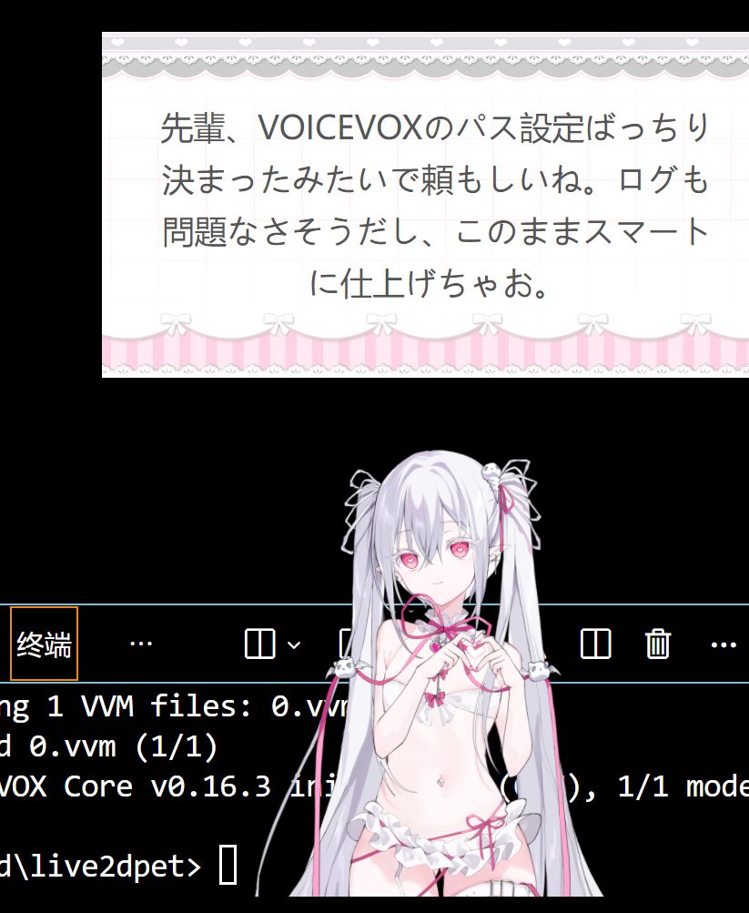
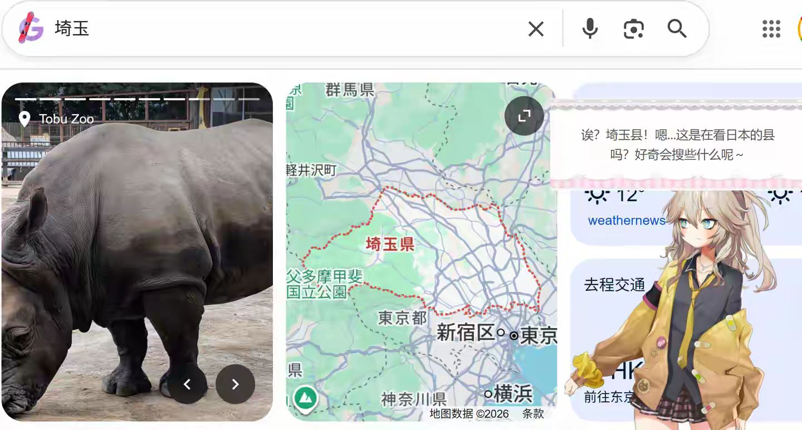
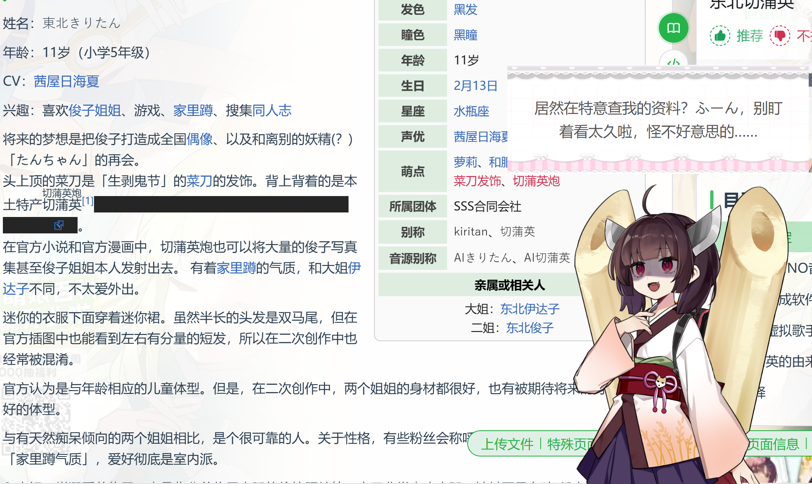

# Live2DPet — AI デスクトップペット

**[English](README.en.md)** | **日本語** | **[中文](README.md)**

   

> 気に入ったら [Star](https://github.com/x380kkm/Live2DPet) をお願いします :)

Electron ベースのデスクトップペット。Live2D キャラクターがデスクトップに常駐し、スクリーンショットとウィンドウ認識であなたの作業内容を理解、AI がコンパニオン対話を生成、クリック/ドラッグ/タッチなどのインタラクションに対応、キーフレーム視覚メモリで AI が最近のアクティビティを把握、VOICEVOX で音声合成を行います。[Claude Code](https://docs.anthropic.com/en/docs/claude-code) による AI 支援開発で構築。

> **プライバシーに関する注意**: 本アプリは定期的にスクリーンショットを撮影し、設定された AI API に送信して分析します。スクリーンショットはディスクに保存されません。ご利用の API プロバイダーを信頼できることを確認し、画面上の機密情報にご注意ください。

<p align="center">
  
</p>

## 使用例

<p align="center">
  
</p>
<p align="center">
  
</p>
<p align="center">
  
</p>

<details>
<summary>モデルクレジット</summary>

【Model】Little Demon<br>
Author：Cai Cat様

【Model】春日部つむぎ (公式)<br>
イラスト：春日部つくし様<br>
モデリング：米田らん様

【Model】東北きりたん ([水德式](https://www.bilibili.com/video/BV1B7dcY1EFU))<br>
イラスト：白白什么雨様<br>
配布：君临德雷克様

*この例で使用されているモデル素材は借用したものです。すべての権利は原作者に帰属します。*

</details>

## クイックスタート

### 方法1：ダウンロード（推奨）

[Releases](https://github.com/x380kkm/Live2DPet/releases) から `Live2DPet.exe` をダウンロードし、ダブルクリックで実行。インストール不要。

### 方法2：ソースから実行

```bash
git clone https://github.com/x380kkm/Live2DPet.git
cd Live2DPet
npm install
node launch.js
```

> VSCode ターミナルでは `npx electron .` ではなく `node launch.js` を使用してください（ELECTRON_RUN_AS_NODE 競合）。

## 使い方

### 1. API 設定

設定パネルの「API 設定」タブに API アドレス、キー、モデル名を入力してください。本アプリは OpenAI 形式の API エンドポイントすべてに対応しており、OpenRouter などのアグリゲーションプラットフォームも利用可能です。

スクリーンショット認識のため、Vision 対応モデルを推奨：
- コスパ推奨：Grok シリーズ
- ミドルレンジ推奨：GPT-o3 / GPT-5.1
- 高品質推奨：Gemini 3 Pro Preview

翻訳 API（TTS 日本語翻訳用）推奨：
- OpenRouter `x-ai/grok-4-fast`

### 2. Live2D モデルのインポート

「モデル」タブで「モデルフォルダを選択」をクリックし、`.model.json` または `.model3.json` を含むディレクトリを選択。システムが自動的に：
- モデルパラメータをスキャンし、目・頭のトラッキングをマッピング
- 表情ファイルとモーショングループをスキャン
- モデルをユーザーデータディレクトリにコピー

画像フォルダ（PNG/JPG/WebP）もキャラクター画像として使用可能 — 下記「画像モデル」を参照。

> Live2D モデルをお持ちでない方は、[Live2D 公式サンプル](https://www.live2d.com/en/learn/sample/)から無料モデルをダウンロードしてお試しください。

### 3. VOICEVOX 音声合成の設定（オプション）

> まず [VOICEVOX 公式サイト](https://voicevox.hiroshiba.jp/) でキャラクターとスタイルを試聴し、お気に入りのモデルをダウンロードしてください。

1. 「TTS」タブで VOICEVOX コンポーネントをインストール（Core + ONNX Runtime + Open JTalk 辞書）
2. VVM 音声モデルを選択してダウンロード
3. 「保存して再起動」ボタンをクリックし、アプリが再起動してモデルを読み込むのを待つ
4. スピーカー、スタイル、その他の音声パラメータを微調整

GPU アクセラレーション（DirectML）対応。AI の応答は自動的に日本語に翻訳され、音声で再生されます。

<details>
<summary>VOICEVOX コンポーネントの手動インストール</summary>

アプリ内のワンクリックインストールが失敗した場合、手動でファイルをダウンロードして配置できます。

**インストール先**: `C:\Users\ユーザー名\AppData\Roaming\live2dpet\voicevox_core`

> 「ユーザー名」をお使いの Windows ユーザー名に置き換えてください。

**ダウンロードリンク**:

| コンポーネント | 必須 | ダウンロード |
|----------------|------|--------------|
| VOICEVOX Core | はい | [voicevox_core-windows-x64-0.16.3.zip](https://github.com/VOICEVOX/voicevox_core/releases/download/0.16.3/voicevox_core-windows-x64-0.16.3.zip) |
| ONNX Runtime (CPU) | はい | [voicevox_onnxruntime-win-x64-1.17.3.tgz](https://github.com/VOICEVOX/onnxruntime-builder/releases/download/voicevox_onnxruntime-1.17.3/voicevox_onnxruntime-win-x64-1.17.3.tgz) |
| ONNX Runtime (GPU) | いいえ | [voicevox_onnxruntime-win-x64-dml-1.17.3.tgz](https://github.com/VOICEVOX/onnxruntime-builder/releases/download/voicevox_onnxruntime-1.17.3/voicevox_onnxruntime-win-x64-dml-1.17.3.tgz) |
| Open JTalk 辞書 | はい | [open_jtalk_dic_utf_8-1.11.tar.gz](https://sourceforge.net/projects/open-jtalk/files/Dictionary/open_jtalk_dic-1.11/open_jtalk_dic_utf_8-1.11.tar.gz/download) |
| デフォルト音声モデル | はい | [0.vvm](https://github.com/VOICEVOX/voicevox_vvm/releases/download/0.16.3/0.vvm) |
| その他の音声モデル | いいえ | [vvm](https://github.com/VOICEVOX/voicevox_vvm/releases/) |

**解凍後のディレクトリ構造**:

```
voicevox_core/
├── c_api/
│   └── voicevox_core-windows-x64-0.16.3/
│       └── lib/
│           └── voicevox_core.dll
├── voicevox_onnxruntime-win-x64-1.17.3/
│   └── lib/
│       └── voicevox_onnxruntime.dll
├── open_jtalk_dic_utf_8-1.11/
│   ├── sys.dic
│   └── ...
└── models/
    ├── 0.vvm
    └── ...
```

ダウンロードしたファイルを上記の対応するパスに解凍し、`.vvm` ファイルを `models/` フォルダに配置してから、アプリを再起動してください。

</details>

### 4. キャラクターのカスタマイズ

「キャラクター」タブで新しいキャラクターカードを作成し、名前、性格、行動ルールを編集。テンプレート変数 `{{petName}}`、`{{userIdentity}}` に対応。

### 5. ペットを起動

設定画面下部の「ペットを起動」をクリック。キャラクターがデスクトップ右下に透明ウィンドウで表示されます。
- ドラッグで位置を移動
- 目がマウスカーソルを追従（Live2D モード）
- AI が定期的にスクリーンショットを撮り、吹き出しで会話

### 画像モデル

Live2D の他に、画像フォルダをキャラクター画像として使用できます：

1. 「モデル」タブでタイプを「画像フォルダ」に選択し、PNG/JPG/WebP 画像を含むフォルダを選択
2. 各画像の用途をタグ付け：待機、会話、表情（複数選択可）
3. 表情画像には表情名を入力 — AI 感情システムが自動的にマッチング
4. クロップスケールスライダーで表示比率を調整

AI が話すと自動的に「会話」画像に切り替わり、感情トリガー時は対応する表情画像に、それ以外は「待機」画像を表示します。

## 機能

- **Live2D デスクトップキャラクター** — 透明フレームレスウィンドウ、常に最前面、目がカーソルを追従
- **画像モデル** — 画像フォルダをキャラクターとして使用、待機/会話/表情でタグ付け、AI 駆動で自動切替
- **AI 視覚認識** — 定期スクリーンショット + アクティブウィンドウ検出、画面内容に応じて AI が応答
- **インタラクションシステム** — クリック/タッチ/ドラッグ/スワイプ/リサイズ、インタラクションイベントを AI コンテキストに注入
- **キーフレーム視覚メモリ** — スクリーンショットを自動サンプリング、VLM が代表的なキーフレームを選択、AI が最近のアクティビティを参照可能
- **VOICEVOX 音声** — ローカル日本語 TTS、自動翻訳、ワンクリックセットアップ
- **感情システム** — AI 駆動の表情・モーション選択、感情蓄積トリガー
- **オーディオステートマシン** — TTS → デフォルトフレーズ → 無音、3モード自動フォールバック
- **モデルホットインポート** — 任意の Live2D モデル、パラメータ自動マッピング、表情・モーション自動スキャン
- **キャラクターペルソナ** — JSON テンプレートで性格と行動ルールを定義、マルチキャラクター対応

> **非推奨**: スマート拡張テキストパイプライン（自動検索、知識整理、知識取得、アクティビティ記憶、VLM 状況抽出）は v2.0 で一時停止。コードスケルトンは保持。

<details>
<summary>アーキテクチャ</summary>

```
Electron Main Process
├── main.js                 アプリライフサイクル管理、モジュール登録
├── src/main/               メインプロセスモジュール（main.js から分離）
│   ├── app-context.js      共有可変状態
│   ├── config-manager.js   設定の永続化 / マイグレーション / 暗号化
│   ├── crypto-utils.js     AES-256-GCM API キー暗号化
│   ├── validators.js       入力バリデーション（UUID / URL / パストラバーサル）
│   ├── window-manager.js   ウィンドウ作成 / 制御 / チャットバブル
│   ├── character-manager.js キャラクターカード CRUD / インポート・エクスポート
│   ├── tts-ipc.js          TTS 合成 / VOICEVOX セットアップ
│   ├── model-import.js     モデルスキャン / パラメータマッピング
│   └── ...                 emotion / enhance / screen / tray / i18n
├── src/core/
│   ├── tts-service.js      VOICEVOX Core FFI (koffi)
│   ├── translation-service.js  中→日 LLM 翻訳 + LRU キャッシュ
│   └── enhance/            拡張サブシステム
│       ├── enhancement-orchestrator.js  オーケストレータ: キーフレーム視覚メモリ
│       ├── vlm-extractor.js    スクリーンショット取得 / Mipmap / キーフレーム選択
│       ├── context-pool.js     短期プール + 長期プール (Jaccard RAG) [非推奨]
│       ├── knowledge-store.js  LLM 知識要約 [非推奨]
│       ├── knowledge-acquisition.js  自動知識取得 [非推奨]
│       ├── search-service.js   Web 検索 IPC [非推奨]
│       └── memory-tracker.js   アクティビティ記憶追跡 [非推奨]

Renderer (3 windows)
├── Settings Window         index.html + settings-ui.js
├── Pet Window              desktop-pet.html + model-adapter.js
└── Chat Bubble             pet-chat-bubble.html

Core Modules (renderer)
├── desktop-pet-system.js   オーケストレータ: スクリーンショット / AI / オーディオ
├── message-session.js      コーディネータ: テキスト + 表情 + オーディオ同期
├── emotion-system.js       感情蓄積 + AI 表情選択 + モーショントリガー
├── audio-state-machine.js  3モードフォールバックステートマシン
├── ai-chat.js              OpenAI 互換 API クライアント
└── prompt-builder.js       システムプロンプト構築 (テンプレート変数)
```

</details>

<details>
<summary>動作環境</summary>

- Windows 10/11
- Node.js >= 18（ソースから実行する場合）
- OpenAI 互換 API キー
- VOICEVOX Core（オプション、音声合成用）

</details>

<details>
<summary>テスト</summary>

```bash
npm test
```

</details>

## 注意事項

- **プライバシー**: スクリーンショットは設定した API にのみ送信され、ディスクには保存されません
- **API 料金**: Vision モデルの呼び出しには料金が発生します。検出間隔を適切に設定してください
- **VOICEVOX**: 音声使用時は「VOICEVOX:キャラ名」のクレジット表記が必要です

## トラブルシューティング

問題が発生した場合、コマンドプロンプト（cmd）を開き、以下のコマンドでプログラムを起動してコンソールログを有効にしてください：

```bash
"フォルダパス\Live2DPet.exe" --enable-logging 2>&1
```

問題発生時のログ出力を記録し、Issue 提出時に添付してください。

### 既知の問題

- スクリーンショット関連の warning は無視して問題ありません。通常動作に影響しません
- VVM 音声モデルの読み取りエラー：`C:\Users\ユーザー名\AppData\Roaming\live2dpet\voicevox_core` でモデルフォルダを見つけ、破損したファイルを削除して再ダウンロードしてください

<details>
<summary>技術スタック</summary>

- [Electron](https://www.electronjs.org/) — デスクトップアプリケーションフレームワーク
- [Live2D Cubism SDK](https://www.live2d.com/en/sdk/about/) + [PixiJS](https://pixijs.com/) + [pixi-live2d-display](https://github.com/guansss/pixi-live2d-display)
- [VOICEVOX Core](https://github.com/VOICEVOX/voicevox_core) — 日本語音声合成エンジン
- [koffi](https://koffi.dev/) — Node.js FFI

</details>

## 更新履歴

[CHANGELOG.md](CHANGELOG.md) を参照。

## ライセンス

MIT — [LICENSE](LICENSE) を参照。

## 募集

- **Live2D モデル**: 著作権の関係上デフォルトモデルは同梱していません — 再配布可能なモデルの提供を歓迎します
- **アプリアイコン**: 現在は開発者のアバターで仮置き中 — デザインの投稿を歓迎します
- **内蔵キャラクターカード**: 面白いキャラクターカードの投稿を歓迎します！内蔵カードは中/英/日の3言語版が必要です。投稿時は `assets/prompts/<uuid>.json`（`i18n` フィールド付き）と `src/main/character-manager.js` の `ensureDefaultCharacters()` を修正してください。フォーマットは既存の内蔵カードを参照

<details>
<summary>内蔵キャラクターカード一覧</summary>

> 英語と日本語版は機械翻訳です。校正の協力を歓迎します。

| キャラクター | 中文 | English | 日本語 | 備考 |
|-------------|------|---------|--------|------|
| 后辈 / Kouhai / 後輩 | ✅ 原文 | ✅ 機械翻訳 | ✅ 機械翻訳 | デフォルトキャラ、毒舌後輩型デスクトップペット |

</details>

## コントリビューター

<a href="https://github.com/x380kkm/Live2DPet/graphs/contributors">
  
</a>

## スポンサー

完全なリストは [SPONSORS.md](SPONSORS.md) を参照。

| スポンサー |
|-----------|
| 柠檬 |

## Star History

[](https://star-history.com/#x380kkm/Live2DPet&Date)
