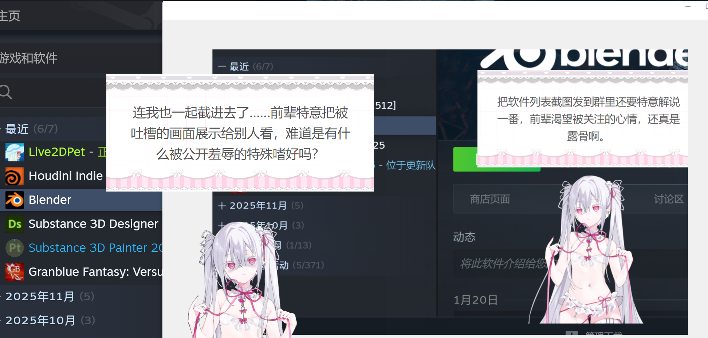

# Live2DPet — AI 桌面宠物伴侣

**[English](README.en.md)** | **[日本語](README.ja.md)** | **中文**

   

> 如果觉得有用，欢迎点个 [Star](https://github.com/x380kkm/Live2DPet) 支持一下 :)

基于 Electron 的桌面宠物。Live2D 角色常驻桌面，通过截屏和窗口感知理解你正在做什么，AI 大模型生成陪伴式对话，支持点击/拖拽等互动，关键帧视觉记忆让 AI 了解你的近期活动，VOICEVOX 语音合成实现语音输出。开发过程中使用 [Claude Code](https://docs.anthropic.com/en/docs/claude-code) 进行 AI 辅助编程。

> **隐私提示**: 本应用会定时截取屏幕画面并发送至你配置的 AI API 进行分析，截图不会保存到本地磁盘。请确保你信任所使用的 API 服务商，并注意避免在屏幕上显示敏感信息。

<p align="center">
  
</p>

## 使用示例

<p align="center">
  
</p>
<p align="center">
  
</p>
<p align="center">
  
</p>

<details>
<summary>模型借物说明</summary>

【Model】Little Demon<br>
Author：Cai Cat様

【Model】春日部つむぎ (公式)<br>
イラスト：春日部つくし様<br>
モデリング：米田らん様

【Model】東北きりたん ([水德式](https://www.bilibili.com/video/BV1B7dcY1EFU))<br>
イラスト：白白什么雨様<br>
配布：君临德雷克様

*本示例使用的模型素材为借物展示，版权归原作者所有。*

</details>

## 快速开始

### 方式一：直接下载（推荐）

从 [Releases](https://github.com/x380kkm/Live2DPet/releases) 下载 `Live2DPet.exe`，双击运行，无需安装。

### 方式二：从源码运行

```bash
git clone https://github.com/x380kkm/Live2DPet.git
cd Live2DPet
npm install
node launch.js
```

> VSCode 终端请用 `node launch.js`，不要用 `npx electron .`（ELECTRON_RUN_AS_NODE 冲突）。

## 使用指南

### 1. 配置 API

启动后打开设置面板，在「API 设置」标签页填入 API 地址、密钥和模型名称。本应用兼容所有 OpenAI 格式的 API 接口，可使用 OpenRouter 等聚合平台。

推荐使用支持 Vision 的模型以获得截屏感知能力：
- 性价比推荐：Grok 系列
- 中端推荐：GPT-o3 / GPT-5.1
- 高质量推荐：Gemini 3 Pro Preview

翻译 API（用于 TTS 日语翻译）推荐：
- OpenRouter `x-ai/grok-4-fast`

### 2. 导入 Live2D 模型

在「模型」标签页点击「选择模型文件夹」，选择包含 `.model.json` 或 `.model3.json` 的目录。系统会自动：
- 扫描模型参数并映射眼球/头部追踪
- 扫描表情文件和动作组
- 将模型复制到用户数据目录

也支持使用图片文件夹作为角色形象，详见下方「图片模型」。

> 没有 Live2D 模型？可以从 [Live2D 官方示例](https://www.live2d.com/en/learn/sample/) 下载免费模型体验。

### 3. 配置 VOICEVOX 语音合成（可选）

> 先到 [VOICEVOX 官网](https://voicevox.hiroshiba.jp/) 试听角色和风格，找到喜欢的再下载对应模型。

1. 在「TTS」标签页安装 VOICEVOX 组件（Core + ONNX Runtime + Open JTalk 辞書）
2. 选择并下载 VVM 语音模型
3. 点击「保存并重启」按钮，等待应用重启加载模型
4. 设置角色（Speaker）、风格（Style）及其他语音参数微调

支持 GPU 加速（DirectML）。AI 回复会自动翻译为日语并语音播放。

### 4. 自定义角色人设

在「角色」标签页新增角色卡，编辑角色的名称、性格、行为规则等。支持模板变量 `{{petName}}`、`{{userIdentity}}`。

### 5. 启动宠物

在设置界面底部点击「启动宠物」，角色会以透明窗口出现在桌面右下角。
- 拖拽角色可移动位置
- 角色眼睛会跟随鼠标（Live2D 模式）
- AI 会定时截屏并通过气泡对话

### 图片模型

除 Live2D 外，还可以使用图片文件夹作为角色形象：

1. 在「模型」标签页选择类型为「图片文件夹」，选择包含 PNG/JPG/WebP 图片的文件夹
2. 为每张图片标记用途：待机、说话、表情（可多选）
3. 表情图片需填写表情名，AI 情绪系统会自动匹配
4. 可通过裁剪缩放滑块调整显示比例

AI 说话时自动切换到「说话」图片，触发情绪时切换到对应表情图片，空闲时显示「待机」图片。

## 功能特性

- **Live2D 桌面角色** — 透明无边框窗口，始终置顶，眼睛跟随鼠标
- **图片模型** — 支持图片文件夹作为角色，按待机/说话/表情分类，AI 驱动自动切换
- **AI 视觉感知** — 定时截屏 + 活动窗口检测，AI 根据屏幕内容主动对话
- **互动系统** — 点击/触摸/拖拽/划过/缩放，互动事件注入 AI 上下文
- **关键帧视觉记忆** — 自动采样截图，VLM 挑选代表性关键帧，AI 可回顾近期活动
- **VOICEVOX 语音** — 本地日语 TTS，自动翻译，一键安装
- **情绪系统** — AI 驱动表情/动作选择，情绪累积触发
- **音频状态机** — TTS → 默认音声 → 静音，三模式自动降级
- **模型热导入** — 任意 Live2D 模型，参数自动映射，表情/动作自动扫描
- **角色人设** — JSON 模板定义角色性格和行为规则，支持多角色切换

> **已弃置**: 智能增强文本管线（自动搜索、知识整理、知识获取、活动记忆、VLM 情景提取）已在 v2.0 中暂停使用，代码骨架保留。

<details>
<summary>项目架构</summary>

```
Electron Main Process
├── main.js                 应用生命周期编排，模块注册
├── src/main/               主进程模块（拆分自 main.js）
│   ├── app-context.js      共享可变状态
│   ├── config-manager.js   配置持久化 / 迁移 / 加密
│   ├── crypto-utils.js     AES-256-GCM API 密钥加密
│   ├── validators.js       输入验证（UUID / URL / 路径遍历）
│   ├── window-manager.js   窗口创建 / 控制 / 气泡
│   ├── character-manager.js 角色卡 CRUD / 导入导出
│   ├── tts-ipc.js          TTS 合成 / VOICEVOX 安装
│   ├── model-import.js     模型扫描 / 参数映射
│   └── ...                 emotion / enhance / screen / tray / i18n
├── src/core/
│   ├── tts-service.js      VOICEVOX Core FFI (koffi)
│   ├── translation-service.js  中→日 LLM 翻译 + LRU 缓存
│   └── enhance/            增强子系统
│       ├── enhancement-orchestrator.js  调度: 关键帧视觉记忆
│       ├── vlm-extractor.js    截图采集 / Mipmap / 关键帧挑选
│       ├── context-pool.js     短期池 + 长期池 (Jaccard RAG) [弃置]
│       ├── knowledge-store.js  LLM 知识整理 [弃置]
│       ├── knowledge-acquisition.js  自动知识获取 [弃置]
│       ├── search-service.js   Web 搜索 IPC [弃置]
│       └── memory-tracker.js   活动记忆追踪 [弃置]

Renderer (3 windows)
├── Settings Window         index.html + settings-ui.js
├── Pet Window              desktop-pet.html + model-adapter.js
└── Chat Bubble             pet-chat-bubble.html

Core Modules (renderer)
├── desktop-pet-system.js   调度: 截屏 / AI 请求 / 音频准备
├── message-session.js      协调: 文字 + 表情 + 音频同步播放
├── emotion-system.js       情绪累积 + AI 表情选择 + 动作触发
├── audio-state-machine.js  三模式降级状态机
├── ai-chat.js              OpenAI 兼容 API 客户端
└── prompt-builder.js       System Prompt 构建 (模板变量替换)
```

</details>

<details>
<summary>环境要求</summary>

- Windows 10/11
- Node.js >= 18（从源码运行时）
- OpenAI 兼容 API Key
- VOICEVOX Core（可选，用于语音合成）

</details>

<details>
<summary>测试</summary>

```bash
npm test
```

</details>

## 注意事项

- **隐私**: 截屏数据仅发送给你配置的 API，不存储到磁盘
- **API 费用**: 视觉模型调用会产生费用，合理设置检测间隔
- **VOICEVOX**: 使用语音时需标注 "VOICEVOX:キャラ名"

## 问题排查

遇到问题时，请打开命令提示符（cmd），通过以下命令启动程序以开启控制台日志：

```bash
"你的文件夹地址\Live2DPet.exe" --enable-logging 2>&1
```

请记录出现问题时的日志输出，提交 Issue 时附上相关信息。

### 已知问题

- 关于截屏错误的 warning 请忽视，不影响正常使用
- VVM 语音模型读取错误：前往 `C:\Users\你的用户名\AppData\Roaming\live2dpet\voicevox_core`，找到存放模型的文件夹，删除损坏的文件后重新下载

<details>
<summary>技术栈</summary>

- [Electron](https://www.electronjs.org/) — 桌面应用框架
- [Live2D Cubism SDK](https://www.live2d.com/en/sdk/about/) + [PixiJS](https://pixijs.com/) + [pixi-live2d-display](https://github.com/guansss/pixi-live2d-display)
- [VOICEVOX Core](https://github.com/VOICEVOX/voicevox_core) — 日语语音合成引擎
- [koffi](https://koffi.dev/) — Node.js FFI

</details>

## 更新日志

详见 [CHANGELOG.md](CHANGELOG.md)。

## License

MIT — 详见 [LICENSE](LICENSE)。

## 征集

- **Live2D 模型**: 由于版权原因本库不提供默认模型，欢迎提供可供分发的 Live2D 模型
- **应用图标**: 当前图标为开发者头像占位，欢迎设计投稿
- **内置角色卡**: 欢迎提交有趣的角色卡！内置角色卡需提供中/英/日三语版本。提交时需修改 `assets/prompts/<uuid>.json`（含 `i18n` 字段）和 `src/main/character-manager.js` 中的 `ensureDefaultCharacters()`。格式参考现有内置卡

<details>
<summary>内置角色卡列表</summary>

> 英语和日语版本为机翻，欢迎校对。

| 角色名 | 中文 | English | 日本語 | 备注 |
|--------|------|---------|--------|------|
| 后辈 / Kouhai / 後輩 | ✅ 原文 | ✅ 机翻 | ✅ 机翻 | 默认角色，毒舌后辈型桌宠 |

</details>

## 贡献者

<a href="https://github.com/x380kkm/Live2DPet/graphs/contributors">
  
</a>

## 赞助者

完整列表见 [SPONSORS.md](SPONSORS.md)。

| 赞助者 |
|--------|
| 柠檬 |

## Star History

[](https://star-history.com/#x380kkm/Live2DPet&Date)
